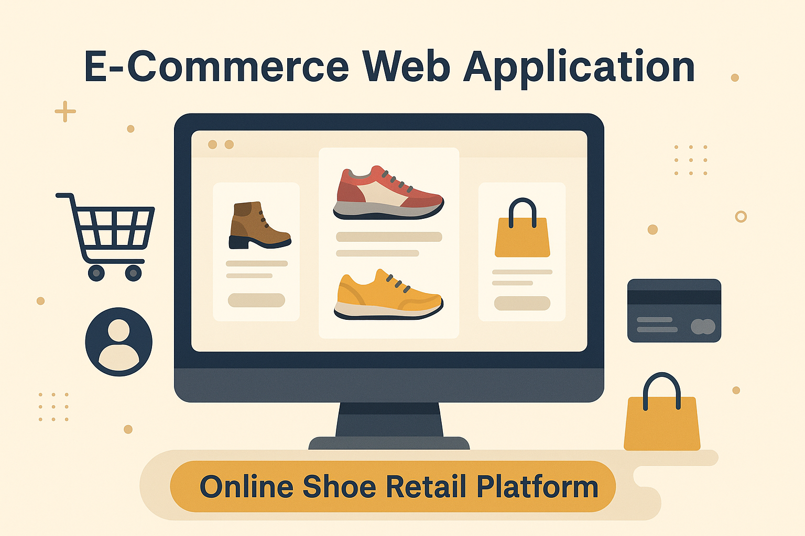

# E-Commerce Web Application — Online Shoe Retail Platform

A comprehensive full-stack e-commerce web application designed for online shoe retail, offering a seamless, secure, and scalable shopping experience for users and administrators.

## Project Overview

This project focuses on building a robust and scalable online shopping platform specifically for shoe retail. Users can browse products, manage their shopping cart, track orders, and securely complete transactions. Admins can manage inventory, orders, and user accounts from a dedicated dashboard.

### Key Features

- **Product Browsing**: Users can explore a catalog of shoes with detailed descriptions and filtering options.
- **Shopping Cart Management**: Add, remove, and update cart items with real-time updates.
- **User Authentication**: Secure login and registration using JWT and OAuth mechanisms.
- **Order Tracking**: View real-time order status and updates.
- **Inventory Management**: Admin panel for managing product listings and stock levels.
- **Payment Integration**: Secure online payments using Stripe gateway.
- **Responsive Design**: Optimized for mobile and desktop experiences.

## Technology Stack

- **Frontend**: HTML, CSS, JavaScript, Bootstrap
- **Backend**: Node.js, Express.js
- **Database**: MongoDB
- **Authentication**: JWT, OAuth
- **Payment Gateway**: Stripe API

## Getting Started

### Prerequisites

- Node.js 18+ 
- MongoDB Database
- Stripe API keys

